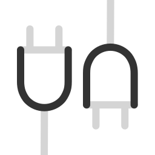

<h1 align='center'>Vue3 SPA</h1>

<br>

<p align='center'>
  <a href="https://vitejs.dev/" target="_blank"></a>
  <a href="https://vuejs.org/" target="_blank"></a>
  <a href="https://pinia.vuejs.org/" target="_blank"></a>
  <a href="https://vitest.dev/" target="_blank"></a>
  <a href="https://vueuse.org/" target="_blank"></a>
  <a href="https://vue-i18n.intlify.dev/" target="_blank"></a>
  <a href="https://unplugin.unjs.io/" target="_blank"></a>
</p>

<p align="center">A simple and pure Vue 3 single-page application starter template.</p>

<p align='center'>
  <a href="https://vue3-spa.netlify.app/">Live Demo</a> |
  <a href="https://github.com/devlaunchpad/vue3-spa/blob/main/README.zh-CN.md">简体中文</a>
</p>

## Introduction

Built with the latest Vue 3 ecosystem technologies, without extra features and UI frameworks, providing developers with the best basic template for starting SPA projects.

## Features

- Mainstream ecosystem: Vue 3, Vite, Vitest, pnpm
- Ready-to-use configurations: TypeScript, ESLint, Prettier, Vitest, Cypress, etc.
- Unified plugin system with Unplugin, auto-import Composables, Components, Stores, Routers
- File-based routing and layout system
- State management with Pinia
- Internationalization with Vue I18n
- Markdown support
- ...

## Configuration

- It is recommended to open the project folder with VSCode. It will prompt you to install extensions; click to agree to install all extensions.
- ESLint and Prettier configurations use [@antfu/eslint-config](https://github.com/antfu/eslint-config). Please read the instructions carefully.
- Use pnpm to install dependencies.

## Directory

```
.
├── .vscode
│   ├── extensions.json                # vscode extensions
│   ├── settings.json                  # vscode settings
├── dist                               # build directory
├── locales                            # translation files
├── node_modules                       # dependency modules
├── public                             # public files
├── src                                # frontend application source code
│   ├── assets                         # static resources
│   ├── components                     # components
│   ├── composables                    # composable functions
│   ├── layouts                        # layouts
│   ├── pages                          # pages
│   ├── stores                         # state
│   ├── styles                         # styles
│   ├── App.vue                        # root component
│   ├── main.ts                        # application entry point
│   ├── shims.d.ts                     # global type definitions
├── test                               # vitest test files
├── types                              # ts type declarations
│   ├── auto-imports.d.ts              # method type definitions
│   ├── components.d.ts                # component type definitions
│   ├── typed-router.d.ts              # router type definitions
├── .editorconfig                      # editor unified configuration
├── .gitignore                         # git ignore configuration
├── .npmrc                             # npm configuration
├── cypress.config.ts                  # cypress configuration
├── eslint.config.js                   # eslint configuration
├── index.html                         # vite application main entry
├── package.json                       # package management
├── pnpm-lock.yaml                     # pnpm version lock
├── README.md                          # project overview
├── tsconfig.json                      # ts configuration
├── tsconfig.node.json                 # ts node configuration
├── vite.config.ts                     # vite configuration
└── vitest.config.ts                   # vitest configuration
```

⚠️ Note:

The contents of the types folder are automatically generated by the unplugin plugin. There are two issues with this:

- When using git for team collaboration, the contents of this folder may have conflicts. You can directly delete the entire types directory and then run pnpm dev to generate the latest type definition files.
- When using CI/CD to build your project on a server by running pnpm build, you may encounter vue-tsc checking errors due to missing type definitions. You should include the types directory in git version control. For more details, you can refer to this [Issues](https://github.com/unplugin/unplugin-auto-import/issues/288#issuecomment-1301691329).

## Getting Started

- node >= 20
- pnpm >= 9.4

```bash
# Clone the project
npx degit devlaunchpad/vue3-spa my-spa

# Enter the directory
cd my-spa

# Install pnpm
npm i pnpm -g

# Install dependencies
pnpm i
```

## Service Commands

```bash
# Development
pnpm dev

# Build
pnpm build

# ESLint check, do not fix
pnpm lint

# ESLint check, with fix
pnpm lint:fix

# Preview the build result, HTTP protocol
pnpm preview

# Preview the build result, HTTPS protocol
pnpm preview:https

# Automated testing, including components, pages, composables, etc.
pnpm test

# Automated e2e testing
pnpm test:e2e

# TypeScript check
pnpm typecheck

# Check for dependency updates
pnpm up

# Rebuild dependencies, dangerous
pnpm ri

# Visualize bundle analysis
pnpm sizecheck
```

## License

[MIT](./LICENSE) License &copy; 2024-PRESENT [Dev LaunchPad](https://github.com/devlaunchpad)
