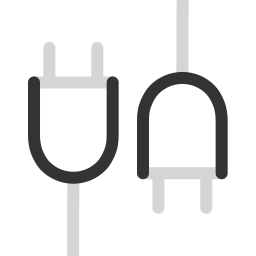

<h1 align='center'>Vue3 SPA</h1>

<br>

<p align='center'>
  <a href="https://vitejs.dev/" target="_blank"></a>
  <a href="https://vuejs.org/" target="_blank"></a>
  <a href="https://pinia.vuejs.org/" target="_blank"></a>
  <a href="https://vitest.dev/" target="_blank"></a>
  <a href="https://vueuse.org/" target="_blank"></a>
  <a href="https://vue-i18n.intlify.dev/" target="_blank"></a>
  <a href="https://unplugin.unjs.io/" target="_blank"></a>
</p>

<p align="center">简单纯粹的 Vue 3 单页应用项目启动模板</p>

<p align='center'>
  <a href="https://vue3-spa.netlify.app/">在线演示</a> |
  <a href="https://github.com/devlaunchpad/vue3-spa/blob/main/README.md">English</a>
</p>

## 简介

基于最新的 Vue 3 生态技术打造，不掺杂多余功能和 UI 框架，为开发者提供启动 SPA 项目所需的最佳基础模板。

## 特性

- Vue 3、Vite、Vitest、pnpm，主流生态
- TypeScript、ESLint、Prettier、Vitest、Cypress 等配置开箱即用
- Unplugin 统一插件系统，Composables、Components、Stores、Routers 自动导入
- 基于文件的路由、 布局系统
- Pinia 状态管理
- Vue I18n 国际化
- Markdown 支持
- ...

## 配置

- 推荐用 VSCode 打开项目文件夹，会提示你安装扩展，点击同意安装所有扩展
- ESLint 和 Prettier 配置采用 [@antfu/eslint-config](https://github.com/antfu/eslint-config)，请仔细阅读说明
- 请用 pnpm 安装依赖

## 目录

```
.
├── .vscode
│   ├── extensions.json                # vscode 扩展
│   ├── settings.json                  # vscode 配置
├── dist                               # 构建目录
├── locales                            # 翻译文件
├── node_modules                       # 依赖模块
├── public                             # 开放文件
├── src                                # 前端应用源码
│   ├── assets                         # 静态资源
│   ├── components                     # 组件
│   ├── composables                    # 组合式函数
│   ├── layouts                        # 布局
│   ├── pages                          # 页面
│   ├── stores                         # 状态
│   ├── styles                         # 样式
│   ├── App.vue                        # 根组件
│   ├── main.ts                        # 应用入口
│   ├── shims.d.ts                     # 全局类型定义
├── test                               # vitest 测试文件
├── types                              # ts 类型声明
│   ├── auto-imports.d.ts              # 方法类型定义
│   ├── components.d.ts                # 组件类型定义
│   ├── typed-router.d.ts              # 路由类型定义
├── .eiditorconfig                     # 编辑器统一规范
├── .gitignore                         # git 忽略配置
├── .npmrc                             # npm 配置
├── cypress.config.ts                  # cypress 配置
├── eslint.config.js                   # eslint 配置
├── index.html                         # vite 应用主入口
├── package.json                       # 包管理
├── pnpm-lock.yaml                     # pnpm 版本锁定
├── README.md                          # 项目简介
├── tsconfig.json                      # ts 配置
├── tsconfig.node.json                 # ts node 配置
├── vite.config.ts                     # vite 配置
└── vitest.config.ts                   # vitest 配置
```

⚠️ 注意：

`types` 文件夹内的内容是由由 unplugin 插件自动生成的，它存在两个问题：

- 使用 git 进行团队协作时，该文件夹中的内容可能会有冲突，你可以直接删除整个 `types` 目录，然后执行 `pnpm dev`，来生成最新的类型定义文件。
- 使用 ci/cd 在服务器中执行 `pnpm build` 构建你的项目时，可能会因为找不到类型定义导致 `vue-tsc` 检测错误，你应该把 `types` 目录加入 `git` 版本控制中，具体可以查看这个 [Issues](https://github.com/unplugin/unplugin-auto-import/issues/288#issuecomment-1301691329)。

## 开始

- node >= 20
- pnpm >= 9.4

```bash
# 克隆项目
npx degit devlaunchpad/vue3-spa my-spa

# 进入目录
cd my-spa

# 安装 pnpm
npm i pnpm -g

# 安装依赖
pnpm i
```

## 服务命令

```bash
# 开发
pnpm dev

# 构建
pnpm build

# ESLint校验，不fix
pnpm lint

# ESLint校验，不fix
pnpm lint:fix

# 预览构建后的效果，http协议
pnpm preview

# 预览构建后的效果，https协议
pnpm preview:https

# 自动化测试，包含组件、页面、组合函数等
pnpm test

# 自动e2e测试
pnpm test:e2e

# ts检测
pnpm typecheck

# 检查依赖更新
pnpm up

# 重建依赖，危险
pnpm ri

# 可视化分析打包结果
pnpm sizecheck
```

## License

[MIT](./LICENSE) License &copy; 2024-PRESENT [Dev LaunchPad](https://github.com/devlaunchpad)
